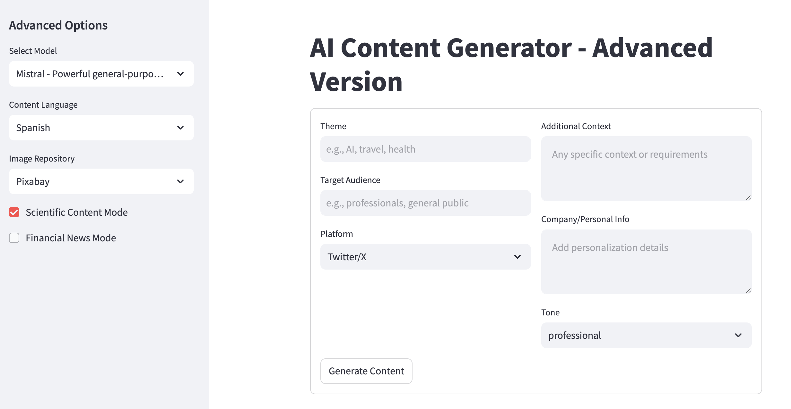

# AI Content Generator 🚀


## Overview

AI Content Generator is an advanced, multi-platform content creation tool powered by machine learning. It allows users to generate high-quality, platform-specific content across various channels like LinkedIn, Twitter/X, Blog, Instagram, and more.

## 🌟 Features

### Multi-Model Support
- **Advanced Language Models**:
  - Mistral 7B
  - Llama 2
  - OpenAI GPT-4o Mini
- Supports multiple languages: Spanish, English, French, Italian

### Flexible Content Generation
- Platform-specific templates
- Customizable tone and style
- Contextual content generation

### Image Integration
- Image retrieval from multiple sources:
  - Pixabay
  - Unsplash
  - AI Image Generation (Stable Diffusion)

### Advanced Modes
- Scientific Content Mode
- Financial News Mode

## 🛠 Prerequisites

### System Requirements
- Python 3.8+
- CUDA-compatible GPU recommended (optional)
- Minimum 16GB RAM

### Required API Keys
- Hugging Face Token
- OpenAI API Key
- Unsplash Access Key
- Pixabay API Key
- Finnhub API Key (for financial news)
- LangSmith API Key (optional, for tracing)

## 🚀 Installation

1. Clone the repository:
```bash
git clone https://github.com/yourusername/ai-content-generator.git
cd ai-content-generator
```

2. Create a virtual environment:
```bash
python -m venv venv
source venv/bin/activate  # On Windows, use `venv\Scripts\activate`
```

3. Install dependencies:
```bash
pip install -r requirements.txt
```

4. Configure Environment Variables:
Create a `.env` file in the project root with the following:
```
HUGGINGFACE_TOKEN=your_huggingface_token
OPENAI_API_KEY=your_openai_api_key
UNSPLASH_ACCESS_KEY=your_unsplash_key
PIXABAY_API_KEY=your_pixabay_key
FINNHUB_API_KEY=your_finnhub_key
LANGCHAIN_API_KEY=your_langsmith_key  # Optional
```

## 💻 Usage

### Streamlit Web Interface
```bash
streamlit run app.py
```

### Configuration Options
- Select AI Model
- Choose Content Language
- Pick Image Repository
- Enable Scientific/Financial Modes

## 🔍 Example Workflow

1. Select a theme (e.g., "AI Innovation")
2. Choose target audience
3. Pick platform (LinkedIn, Blog)
4. Configure additional context
5. Generate content with one click!

## 🧠 Advanced Modes

### Scientific Content Mode
- Retrieves academic papers from arXiv
- Uses semantic search for relevance
- Generates context-aware scientific content

### Financial News Mode
- Fetches real-time market news
- Integrates latest financial insights

## 📦 Project Structure
```
ai-content-generator/
│
├── app.py                # Streamlit application
├── config.py             # Configuration management
├── src/
│   ├── models.py         # Content generation models
│   ├── image_utils.py    # Image retrieval and generation
│   ├── utils.py          # Utility functions
│   └── prompts.py        # Platform-specific templates
│
├── requirements.txt      # Python dependencies
└── .env                  # Environment configuration
```

## 🤝 Contributing
1. Fork the repository
2. Create your feature branch
3. Commit your changes
4. Push to the branch
5. Create a Pull Request

## 📄 License
MIT License

## 🌈 Disclaimer
This tool is an AI assistant. Always review and validate generated content.

## 🎉 Acknowledgments
- Hugging Face
- OpenAI
- Stable Diffusion
- Streamlit
```